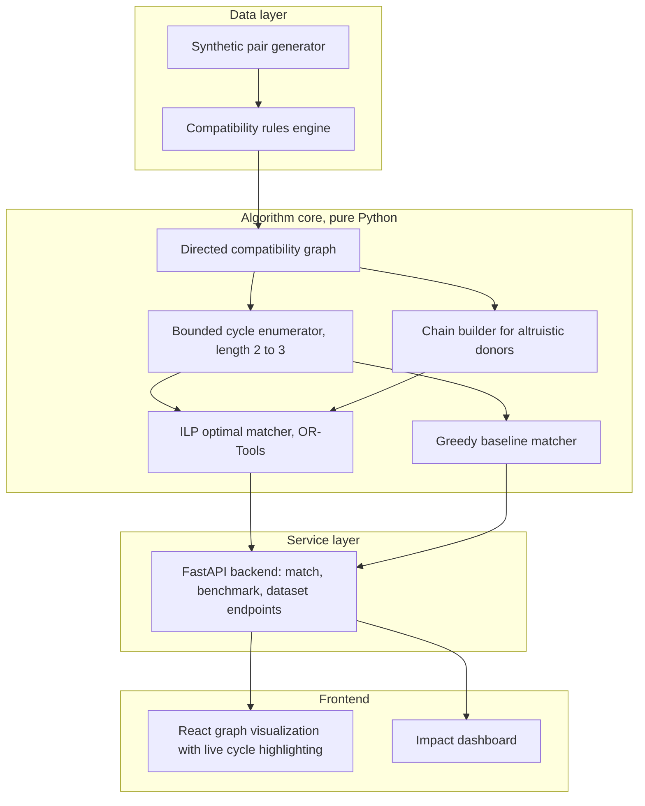

<div align="center">

# Kidney Exchange Matching System

### Turning incompatible donor pairs into compatible transplant chains, using real graph theory and optimization, not an API call

[](https://www.python.org/)
[](https://fastapi.tiangolo.com/)
[](https://react.dev/)
[](https://developers.google.com/optimization)
[](https://networkx.org/)
[](./LICENSE)
[]()
[]()

<br/>

**[Live demo](#) &nbsp;•&nbsp; [Problem statement](#the-problem) &nbsp;•&nbsp; [How it works](#how-it-works) &nbsp;•&nbsp; [Architecture](#architecture) &nbsp;•&nbsp; [Benchmarks](#benchmarks) &nbsp;•&nbsp; [Getting started](#getting-started) &nbsp;•&nbsp; [References](#references)**

</div>

<br/>

<div align="center">
  
  <p><i>Placeholder: record a short screen capture of a 3 way cycle lighting up on the graph and drop it at <code>docs/assets/demo.gif</code>. This single visual is usually what makes judges stop scrolling.</i></p>
</div>

<br/>

## Table of contents

- [The problem](#the-problem)
- [The idea, in one paragraph](#the-idea-in-one-paragraph)
- [How it works](#how-it-works)
- [Architecture](#architecture)
- [What makes this different from a typical hackathon project](#what-makes-this-different-from-a-typical-hackathon-project)
- [Features](#features)
- [Tech stack](#tech-stack)
- [Project structure](#project-structure)
- [Getting started](#getting-started)
- [API reference](#api-reference)
- [Benchmarks](#benchmarks)
- [Screenshots](#screenshots)
- [Roadmap](#roadmap)
- [Contributing and git workflow](#contributing-and-git-workflow)
- [References](#references)
- [Team](#team)
- [License](#license)

<br/>

## The problem

As of mid 2026, roughly 90,000 to 100,000 people are on the kidney transplant waiting list in the United States alone, and the median wait for a first kidney transplant is measured in years, not months. On average, around a dozen people die every single day while still waiting for a match. This isn't a niche medical inconvenience, it's one of the largest and most persistent supply gaps in modern healthcare.

A huge part of the problem isn't a lack of willing donors. Many patients already have a family member or friend who wants to donate a kidney to them directly. The problem is biology: the donor's blood type or tissue markers don't match the patient's, so a direct transplant would be rejected by the patient's immune system. This is called an incompatible pair, and it happens far more often than most people expect.

Here's the insight that real kidney exchange programs are built on: even though donor A cannot give to patient A, donor A's kidney might be a perfect match for patient B, whose own donor, donor B, might in turn be a perfect match for patient A. Neither pair could complete a transplant alone, but together they can, through a coordinated swap. Extend this logic across a pool of hundreds of incompatible pairs, and you get three way swaps, four way swaps, and long donor chains kicked off by a single altruistic, non directed donor. Programs like the National Kidney Registry have used this exact mechanism to complete chains involving as many as 70 participants, and roughly three quarters of all transplants facilitated through major kidney paired donation networks now happen through chains rather than simple pairwise swaps.

This project builds that matching engine from scratch: the graph model, the cycle search, and the optimization layer that decides which swaps actually go ahead.

<br/>

## The idea, in one paragraph

Model every incompatible patient-donor pair as a node in a directed graph. Draw an edge from pair A to pair B whenever A's donor is medically compatible with B's patient. Once the graph is built, the matching problem becomes a graph problem: find a set of node disjoint cycles (bounded to length 2 or 3, since longer cycles require every surgery to happen simultaneously across every hospital involved) plus open chains starting from altruistic donors, such that the total number of matched patients is maximized. This is exactly the problem real national kidney exchange clearinghouses solve every single day, and it happens to sit in a genuinely interesting complexity class: pairwise matching is solvable in polynomial time, but anything involving 3 way cycles or larger becomes NP-hard, which is why real programs lean on integer programming rather than brute force.

<br/>

## How it works

1. **Generate or ingest patient-donor pairs.** Each pair carries a patient blood type, a donor blood type, and a simulated crossmatch compatibility score. For the demo, a synthetic generator produces realistic pools using population level blood type distributions instead of uniform random data, so the numbers you see in the dashboard actually mean something.

2. **Build the compatibility graph.** Every pair becomes a node. A directed edge is added from pair A to pair B when A's donor could safely donate to B's patient. This is handled with NetworkX so the graph itself is inspectable, exportable, and easy to visualize.

3. **Enumerate candidate cycles.** A bounded depth first search finds every cycle of length 2 and length 3 in the graph. The length cap of 3 isn't arbitrary, it mirrors the real world constraint that every surgery in a cycle has to happen on the same day, in every hospital involved, since no donor can be asked to wait and risk the other side of the swap falling through.

4. **Solve for the optimal set of disjoint cycles.** This is where the actual optimization happens. Each candidate cycle becomes a binary decision variable, and an integer linear program (solved with Google OR-Tools' CBC solver) picks the combination of non overlapping cycles that maximizes total patients matched. A greedy baseline algorithm runs alongside it, picking the highest value cycles first, so the project can show, with real numbers, exactly how much better the optimal solution is and at what computational cost.

5. **Visualize the result.** The frontend renders the full compatibility graph and animates the specific cycles that were selected, so a viewer can watch a 3 way swap light up in real time instead of reading a results table.

<br/>

## Architecture



The separation between the algorithm core and the API layer is intentional: the matching engine is a standalone Python library with its own tests, runnable and benchmarkable with zero web framework involved. This is what lets you demonstrate, in a terminal, that the actual computer science works, before a single line of frontend code runs.

<br/>

## What makes this different from a typical hackathon project

Most social impact hackathon projects in this space end up being a form that calls an AI API and generates a summary. This project deliberately avoids that pattern. There is no language model anywhere in the matching pipeline. Every match that gets suggested is the output of a deterministic, verifiable algorithm that can be explained on a whiteboard, and that mirrors a decision making process actually used in production by real transplant networks.

The parts worth highlighting to judges:

- A real NP-hard-adjacent optimization problem, solved with an actual ILP formulation, not a heuristic dressed up as one.
- A quantified comparison between the optimal solver and a greedy baseline, so the value of "doing it properly" is shown with numbers and a chart, not asserted.
- A visual, animated demonstration of the exact mechanism, a cycle of pairs lighting up on a live graph, that makes the abstract idea instantly understandable to a non technical judge.
- Grounding in the actual academic literature and actual production systems, both cited below, rather than a reinvented wheel.

<br/>

## Features

| Feature | Description | Status |
|---|---|---|
| Synthetic dataset generator | Produces realistic patient-donor pools using population level blood type distributions | Planned |
| Compatibility graph builder | Converts a pair pool into a directed graph using NetworkX | Planned |
| Bounded cycle enumeration | Finds every valid 2 way and 3 way exchange cycle | Planned |
| Altruistic donor chains | Supports open ended chains started by non directed donors | Planned |
| ILP optimal matcher | Maximizes total matched patients using Google OR-Tools | Planned |
| Greedy baseline matcher | Fast approximate matcher, used for benchmarking against the optimal solver | Planned |
| Benchmark suite | Compares match rate and runtime of optimal vs greedy across pool sizes | Planned |
| REST API | FastAPI endpoints for running matches, generating data, and fetching benchmarks | Planned |
| Interactive graph visualization | Renders the compatibility graph and animates selected cycles | Planned |
| Impact dashboard | Shows patients matched with versus without exchange, side by side | Planned |

Update the status column as each phase lands, this table doubles as a lightweight project tracker that judges and teammates can both read at a glance.

<br/>

## Tech stack

<table>
<tr>
<td valign="top" width="33%">

**Algorithm core**
- Python 3.11+
- NetworkX
- Google OR-Tools (CBC solver)
- PuLP (alternative ILP interface)
- pytest for correctness tests

</td>
<td valign="top" width="33%">

**Backend service**
- FastAPI
- Uvicorn
- Pydantic for request and response models
- pytest and httpx for API tests

</td>
<td valign="top" width="33%">

**Frontend**
- React
- A graph visualization library (react-flow or a D3 force layout)
- Recharts for the benchmark and impact charts
- Vite for the build tooling

</td>
</tr>
</table>

<br/>

## Project structure

```
kidney-exchange-matching/
├── backend/
│   ├── algorithm_core/
│   │   ├── models.py            # Patient, Donor, IncompatiblePair
│   │   ├── generator.py         # synthetic dataset generator
│   │   ├── compatibility.py     # blood type and crossmatch rules
│   │   ├── graph_builder.py     # builds the directed compatibility graph
│   │   ├── cycle_finder.py      # bounded length cycle enumeration
│   │   ├── chain_finder.py      # altruistic donor chain construction
│   │   ├── optimal_matcher.py   # ILP formulation and solver
│   │   ├── greedy_matcher.py    # greedy baseline
│   │   └── tests/
│   ├── api/
│   │   ├── main.py               # FastAPI app entrypoint
│   │   ├── routes/
│   │   └── schemas/
│   └── benchmarks/
│       └── run_benchmarks.py
├── frontend/
│   ├── src/
│   │   ├── components/
│   │   │   ├── GraphView.jsx
│   │   │   ├── ImpactDashboard.jsx
│   │   │   └── BenchmarkChart.jsx
│   │   └── App.jsx
│   └── package.json
├── data/
│   └── sample_pairs.csv
├── docs/
│   ├── assets/                   # screenshots, gifs, diagrams
│   └── architecture.md
├── .gitignore
├── LICENSE
└── README.md
```

<br/>

## Getting started

These steps assume you have Python 3.11 or newer and Node.js 18 or newer installed.

**1. Clone the repository**

```bash
git clone https://github.com/your-username/kidney-exchange-matching.git
cd kidney-exchange-matching
```

**2. Set up the backend**

```bash
cd backend
python -m venv venv
source venv/bin/activate        # on Windows, use venv\Scripts\activate
pip install -r requirements.txt
```

This creates an isolated Python environment so the project's dependencies don't clash with anything else installed on your machine, then installs everything the algorithm core and API need.

**3. Run the algorithm core on its own, no server required**

```bash
python -m algorithm_core.demo
```

This runs the full pipeline end to end on a small synthetic dataset and prints the matched cycles straight to the terminal. Useful for proving the algorithm works before touching the web layer at all.

**4. Start the API server**

```bash
uvicorn api.main:app --reload
```

The API will be available at `http://localhost:8000`, with interactive documentation automatically generated at `http://localhost:8000/docs`.

**5. Set up and run the frontend**

```bash
cd ../frontend
npm install
npm run dev
```

Open the printed local URL in your browser to see the graph visualization and dashboard.

<br/>

## API reference

| Method | Endpoint | Description |
|---|---|---|
| `POST` | `/dataset/generate` | Generates a synthetic pool of incompatible patient-donor pairs |
| `POST` | `/graph/build` | Builds the compatibility graph from a given pair pool |
| `POST` | `/match/optimal` | Runs the ILP solver and returns the optimal set of matched cycles and chains |
| `POST` | `/match/greedy` | Runs the greedy baseline matcher for comparison |
| `GET` | `/benchmark` | Returns match rate and runtime results across a range of pool sizes |

Full request and response schemas are documented automatically by FastAPI at the `/docs` endpoint once the server is running.

<br/>

## Benchmarks

This table is a placeholder, replace it with real numbers once phase 7 of the build is done. Judges respond well to a table exactly like this because it proves the ILP versus greedy comparison isn't just a talking point.

| Pool size | Optimal matched | Greedy matched | Optimal runtime | Greedy runtime |
|---|---|---|---|---|
| 50 pairs | TBD | TBD | TBD | TBD |
| 200 pairs | TBD | TBD | TBD | TBD |
| 1000 pairs | TBD | TBD | TBD | TBD |
| 2000 pairs | TBD | TBD | TBD | TBD |

<br/>

## Screenshots

<div align="center">
<table>
<tr>
<td width="50%"><p align="center"><i>Full compatibility graph, before matching</i></p></td>
<td width="50%"><p align="center"><i>A 3 way swap highlighted after matching</i></p></td>
</tr>
<tr>
<td width="50%"><p align="center"><i>Patients matched, with versus without exchange</i></p></td>
<td width="50%"><p align="center"><i>Optimal versus greedy, match rate and runtime</i></p></td>
</tr>
</table>
</div>

All four of these are placeholders. Drop real screenshots into `docs/assets/` with the matching filenames and they will render automatically once pushed.

<br/>

## Roadmap

- [x] Finalize problem scope and algorithmic approach
- [ ] Core data models and synthetic dataset generator
- [ ] Compatibility graph construction
- [ ] Bounded cycle enumeration
- [ ] ILP optimal matcher
- [ ] Greedy baseline matcher and benchmark suite
- [ ] FastAPI backend
- [ ] Interactive frontend with live cycle highlighting
- [ ] Impact dashboard
- [ ] Stretch: non simultaneous extended altruistic donor chains beyond length 3
- [ ] Stretch: multi hospital pooling simulation
- [ ] Stretch: fairness aware objective, weighting rare blood types and highly sensitized patients

<br/>

## Contributing and git workflow

This project follows conventional commits, so the history itself tells the story of how it was built.

```
feat: short description of a new capability
fix: short description of a bug fix
test: short description of what is being tested
docs: short description of a documentation change
chore: short description of tooling or config work
```

Each meaningful piece of work lives on its own branch and gets merged individually, rather than as one large commit, so the commit history remains a readable record of the engineering process:

```bash
git checkout -b feat/ilp-optimal-matcher
# do the work
git add .
git commit -m "feat: add ILP formulation for optimal disjoint cycle packing"
git push origin feat/ilp-optimal-matcher
# open a pull request, merge into main
```

<br/>

## References

This project is grounded in real academic work and real production kidney exchange programs, not invented from scratch. Worth reading if you want to go deeper, or if a judge asks where the algorithm comes from.

**Academic foundations**

- Abraham, D. J., Blum, A., and Sandholm, T. (2007). *Clearing algorithms for barter exchange markets: enabling nationwide kidney exchanges.* ACM Conference on Electronic Commerce. The paper that formalized the cycle and chain clearing problem this project implements.
- Roth, A. E., Sonmez, T., and Unver, M. U. (2004). *Kidney exchange.* The Quarterly Journal of Economics. Foundational economic and mechanism design treatment of the matching problem.
- Anderson, R., Ashlagi, I., Gamarnik, D., and Roth, A. E. (2015). *Finding long chains in kidney exchange using the traveling salesman problem.* Proceedings of the National Academy of Sciences. Explains why chains, not just cycles, dominate real world matching outcomes.

**Real world programs, for grounding the numbers used in this project**

- National Kidney Registry, kidney paired donation overview and program statistics.
- United Network for Organ Sharing (UNOS), national transplant waiting list data.
- Centers for Medicare and Medicaid Services, Increasing Organ Transplant Access (IOTA) model, current waiting list and mortality figures.

**Tools used**

- [NetworkX documentation](https://networkx.org/documentation/stable/)
- [Google OR-Tools documentation](https://developers.google.com/optimization/introduction/overview)
- [FastAPI documentation](https://fastapi.tiangolo.com/)

<br/>

## Team

Built for the NSUT hackathon under the Open Innovation and Social Impact track.

| Name | Role |
|---|---|
| Your name | Algorithm design and backend |
| Teammate name | Frontend and visualization |
| Teammate name | Data modeling and benchmarking |

<br/>

## License

This project is released under the MIT License. See [LICENSE](./LICENSE) for the full text.

<div align="center">
<br/>
<i>If two incompatible pairs can save each other, the graph should be the one to notice.</i>
</div>
